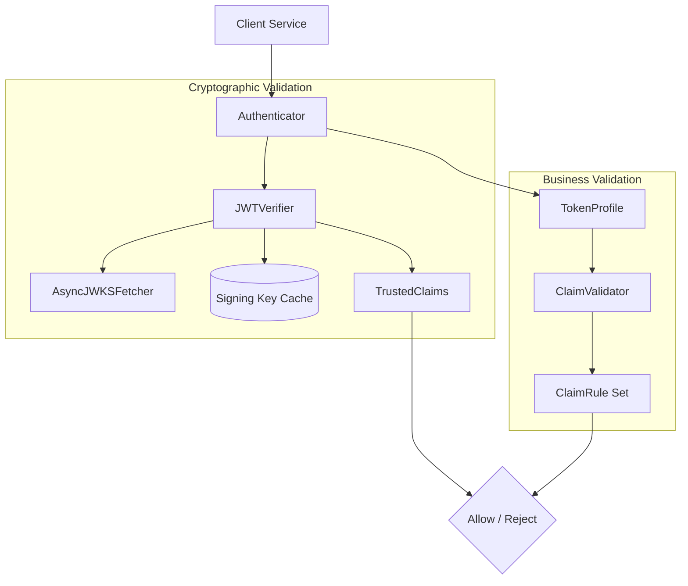
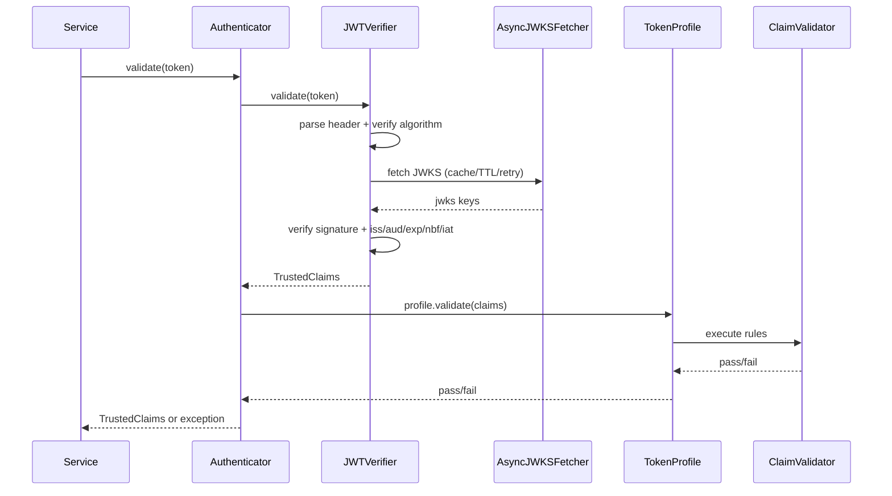

# token-validator

<p align="left">
    
    
    
</p>

JWT validation library for Python services.

- Validates `User` tokens
- Validates `Auth0` tokens
- Exposes a clean library API for other services

## Why Use This Library

- Shared and consistent JWT validation across services
- Built-in issuer, audience, signature, and claim checks
- Ready-to-run examples for both token types
- Unit and integration test coverage

## Install

### Option 1: Add in `pyproject.toml`

```toml
jwt-lib = { git = "https://github.com:vyavasthita/token-validator.git", branch = "main" }
```

### Option 2: add directly with Poetry

```bash
poetry add "git+https://github.com:vyavasthita/token-validator.git"
```

## Quick Start

Validating User Token
```python
from jwt_lib.authenticator import UserAuthenticator

authenticator = UserAuthenticator(
        issuer="https://login.example.com/",
        jwks_host="https://login.example.com/",
        audience="my-first-party-app",
)

claims = await authenticator.validate(token)
print(claims.subject)
```

### Enforcing Roles (User Token)
#### Available Extra Rules

| Rule | Logic | Claim | Use case |
|---|---|---|---|
| `RequireRole` | AND | `roles` (list) | Endpoint needs **all** listed roles |
| `RequireAnyRole` | OR | `roles` (list) | Endpoint needs **any one** of the listed roles |
| `RequireScopes` | AND | `scope` (str) | Endpoint needs all listed OAuth scopes |
| `RequireAnyScope` | OR | `scope` (str) | Endpoint needs any one OAuth scope |
| `RequireClaim` | exact | any | Claim must exist (optionally with a specific value) |
| `RequireSubject` | exact | `sub` | Token must belong to a specific subject |
| `RequireGrantType` | exact | `gty` | Token must have a specific grant type |
| `RequireClaimIn` | in-set | any | Claim value must be one of an allowed set |

## Run This Repository Locally

```bash
cd token-validator
```

```bash
poetry install --extras test
```

`--extras test` installs local test-only dependencies while keeping published package dependencies lean.

## Examples

Examples are available in `examples/`.

### User Token Example

```bash
export AUTH_USER_ISSUER="https://login.example.com/"
export AUTH_USER_JWKS_HOST="https://login.example.com/"
export AUTH_USER_AUDIENCE="my-first-party-app"
export AUTH_TOKEN="<jwt here>"
poetry run python examples/user_token_validation_example.py
```

### Auth0 Token Example

```bash
export AUTH_0_ISSUER="https://tenant.auth0.com/"
export AUTH_0_JWKS_HOST="https://tenant.auth0.com/"
export AUTH_0_AUDIENCE="https://api.example.com"
export AUTH_0_TOKEN="<jwt here>"
poetry run python examples/auth0_token_validation_example.py
```

### Architecture Summary Example

```bash
poetry run python examples/architecture_summary_example.py
```

## Run Tests

```bash
poetry run pytest
```

# Architecture Overview

This document shows how `token-validator` combines cryptographic verification and business claim validation.

## High-Level Components



## Request Lifecycle



## Core Roles

- `Authenticator`: single entry point for each token type.
- `JWTVerifier`: JOSE header checks, JWKS resolution, cryptographic verification.
- `AsyncJWKSFetcher`: HTTP fetch + retry + TTL caching for JWKS document.
- `TokenProfile`: token-type-specific business checks.
- `ClaimValidator`: executes reusable `ClaimRule` objects.
- `TrustedClaims`: immutable container returned after successful verification.

## Validation Coverage

### User Token

| Area | Rules |
|---|---|
| Header | `kid` present, `typ=JWT`, `alg=RS256` |
| Standard claims | `iss`, `aud`, `exp`, `nbf`, `iat` |
| Domain claims | `tokenType=UserAuthToken`, `principalType=USER`, `connectionMethod in {SAML, UIDPWD}` |

### Auth0 Token

| Area | Rules |
|---|---|
| Header | allowed algorithm |
| Standard claims | `iss`, optional `aud`, `exp` |
| Domain claims | `gty=client-credentials`, optional `appName` |

## Repository Layout


<details>
<summary><strong>Project Layout</strong></summary>

```text
token-validator/
    src/jwt_lib/
    tests/
    examples/
```

</details>