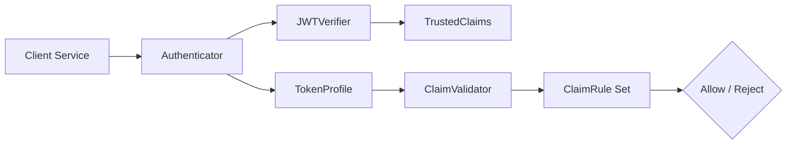

# Architecture Overview

This document explains how the JWT validation stack composes cryptographic guarantees with business-rule enforcement.



---

## Component Roles

### Authenticator (Orchestration)
- Wires a concrete `JWTVerifier` with a matching `TokenProfile`.
- Exposes a single `validate()` entry point so callers avoid issuer/JWKS wiring.
- Reference: [src/jwt_lib/authenticator](../src/jwt_lib/authenticator).

### JWTVerifier (Cryptographic Trust)
- Handles JWKS lookup, signature validation, and issuer/audience enforcement.
- Concrete subclasses (`Auth0JWTVerifier`, `UserJWTVerifier`) add header/temporal policies.
- Reference: [src/jwt_lib/verifier](../src/jwt_lib/verifier).

### TrustedClaims (Immutable Facts)
- Provides a read-only view of verified claims and optional JOSE headers.
- Ensures downstream code cannot mutate the trusted data structure.
- Implementation: [src/jwt_lib/claims/trusted_claims.py](../src/jwt_lib/claims/trusted_claims.py).

### TokenProfile (Business Policies)
- Encodes domain-specific requirements (token type, principal type, scopes).
- Accepts extra runtime rules supplied by callers when needed.
- Reference: [src/jwt_lib/profiles](../src/jwt_lib/profiles).

### ClaimValidator (Rule Engine)
- Executes an ordered list of `ClaimRule` objects with short-circuit semantics.
- Provides consistent error handling so profiles stay declarative.
- Implementation: [src/jwt_lib/validation/engine.py](../src/jwt_lib/validation/engine.py).

### ClaimRule Implementations
- Contains reusable rules such as `RequireScopes`, `RequireClaim`, `RequireClaimIn`.
- Allows adding custom rules without modifying authenticators or the validator.
- Reference: [src/jwt_lib/validation/rules.py](../src/jwt_lib/validation/rules.py).

---

## User Token Validation Done
### Header Validation
1. kid = A key with <kid> in the key set downloaded from jwks url
2. type = JWT
3. alg = RS256

### Body Validation
1. iss = https://auth.anaplan.com
2. sub = NA
3. tid = NA
4. targetTenantId = NA
5. aud = https://api.anaplan.com
6. uid = NA
7. iat = not in the future (within clock skew) and optionally not too old (max token age)
8. nbf = now >= nbf
9. now < exp
10. maxExpiry = NA
11. refreshTokenId = NA
12. tokenType = AnaplanAuthToken
13. principalType = USER
14. jti = NA
15. connectionMethod = SAML, UIDPWD
16. ssoServerGuid = NA

---

## Repository Layout

- `src/jwt_lib/`: installable package distributed to clients (only directory shipped in the wheel)
- `examples/`, `docs/`, `tests/`: contributor resources kept out of the packaged artifact

---

### How to Call
```python
from jwt_lib.authenticator import UserAuthenticator

authenticator = UserAuthenticator(
    issuer="",
    jwks_host="",
    audience="",
)

claims = await authenticator.validate(token)  # UserJWTVerifier + UserProfile run together
```

### TrustedClaims object
`validate()` returns a `TrustedClaims` instance (see [src/jwt_lib/claims/trusted_claims.py](src/jwt_lib/claims/trusted_claims.py)).

It behaves like a read-only dict and offers convenience properties:

- `claims.subject` → `sub`
- `claims.issuer` → `iss`
- `claims.audience` → `aud`
- `claims.expiration` → `exp` (Unix timestamp)
- `claims.issued_at` → `iat`
- `claims.not_before` → `nbf`
- `claims.jwt_id` → `jti`
- `claims.headers` → copy of the JOSE header
- `claims.get_header("kid")` → header helper
- `claims.to_dict()` → shallow copy of all claims

---