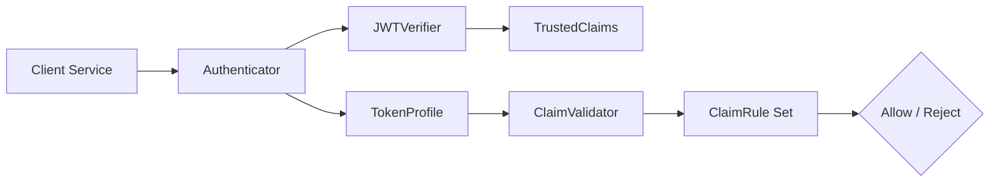

# Architecture Overview

This document explains how the JWT validation stack composes cryptographic guarantees with business-rule enforcement.

## Component Roles

### Authenticator (Orchestration)
- Wires a concrete `JWTVerifier` with a matching `TokenProfile`.
- Exposes a single `validate()` entry point so callers avoid issuer/JWKS wiring.
- Reference: [packages/python/jwt_lib/src/authenticator](../jwt_lib/src/authenticator).

### JWTVerifier (Cryptographic Trust)
- Handles JWKS lookup, signature validation, and issuer/audience enforcement.
- Concrete subclasses (`Auth0JWTVerifier`, `UserJWTVerifier`) add header/temporal policies.
- Reference: [packages/python/jwt_lib/src/verifier](../jwt_lib/src/verifier).

### TrustedClaims (Immutable Facts)
- Provides a read-only view of verified claims and optional JOSE headers.
- Ensures downstream code cannot mutate the trusted data structure.
- Implementation: [packages/python/jwt_lib/src/claims/trusted_claims.py](../jwt_lib/src/claims/trusted_claims.py).

### TokenProfile (Business Policies)
- Encodes domain-specific requirements (token type, principal type, scopes).
- Accepts extra runtime rules supplied by callers when needed.
- Reference: [packages/python/jwt_lib/src/profiles](../jwt_lib/src/profiles).

### ClaimValidator (Rule Engine)
- Executes an ordered list of `ClaimRule` objects with short-circuit semantics.
- Provides consistent error handling so profiles stay declarative.
- Implementation: [packages/python/jwt_lib/src/validation/engine.py](../jwt_lib/src/validation/engine.py).

### ClaimRule Implementations
- Contains reusable rules such as `RequireScopes`, `RequireClaim`, `RequireClaimIn`.
- Allows adding custom rules without modifying authenticators or the validator.
- Reference: [packages/python/jwt_lib/src/validation/rules.py](../jwt_lib/src/validation/rules.py).
